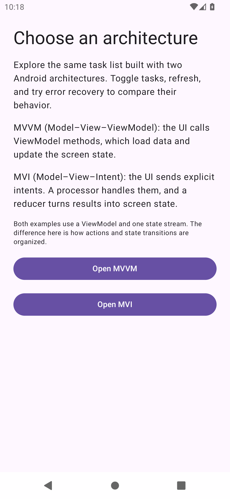
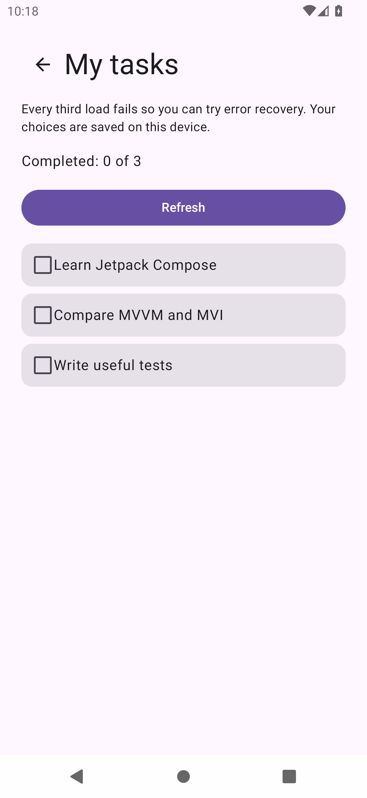
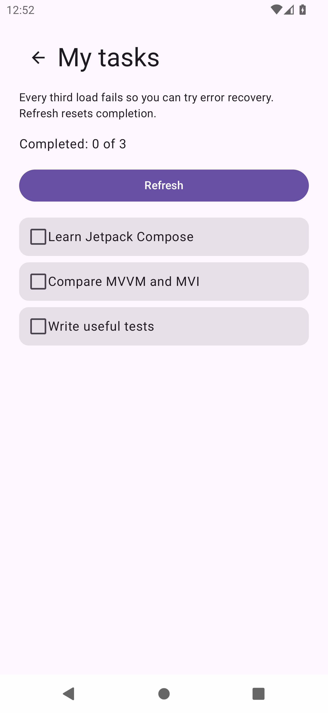

# MVVM vs MVI in Android

A small Kotlin / Jetpack Compose application for comparing **Model–View–ViewModel (MVVM)** with **Model–View–Intent (MVI)**. The launcher briefly explains both approaches and offers full-width buttons to choose an implementation. Both activities render the **same production composable**, use the same domain use cases and fake repository implementation, and offer identical behavior.

The example is deliberately small enough to read alongside a blog post. No backend, credentials, dependency injection framework, or network permission is required.

## Try it

1. Open the repository in Android Studio with support for AGP 8.13.2.
2. Install Android SDK Platform 36 and configure **JDK 21** as the Gradle JDK.
3. Let Gradle sync, then run the `app` configuration on an emulator or device (Android 7.0 / API 24 or newer).
4. Choose **Open MVVM** or **Open MVI**.
5. Toggle a task, refresh, and compare the code handling those actions.

Each activity owns a fresh fake repository, retained by its ViewModel across configuration changes. Load 1 succeeds automatically, load 2 succeeds on refresh, and load 3 fails. **Retry** runs load 4 and succeeds. Every third load fails. Failed refreshes retain the existing tasks; successful refreshes restore the original, incomplete tasks. Inputs are disabled during loading. The top back button and System Back return to the chooser.

Task completion is intentionally session-local. Rotation preserves it; process death or reopening an activity starts a new scenario. There is no database or saved-state restoration in this sample.

## Screenshots

Captured from the real activities on an Android 12 / API 31 emulator.

| Chooser | MVVM | MVI |
| --- | --- | --- |
|  |  |  |

## What is actually different?

| Concern | This MVVM implementation | This MVI implementation |
| --- | --- | --- |
| UI entry points | `refresh()` and `toggle(id)` methods | `accept(TasksIntent)` |
| Action representation | Method calls | Explicit sealed intents: `Refresh`, `Toggle` |
| Asynchronous work | ViewModel methods launch work | A single intent consumer processes work serially |
| State transitions | ViewModel updates `TasksState` directly | Results pass through the pure `reduce(state, result)` function |
| Rendered state | Read-only `StateFlow<TasksState>` | Read-only `StateFlow<TasksState>` |
| Rendering | Shared `TasksScreen` | Shared `TasksScreen` |
| Tests | Observable behavior contract | Same contract, plus reducer tests |

**MVVM does not require multiple mutable observables or two-way binding.** Modern Android MVVM can use immutable state snapshots and unidirectional data flow, as it does here. **MVI is a family of approaches**, not one mandated library or class structure. This sample makes intents, results, and a reducer explicit to illustrate that approach. Merely renaming ViewModel methods to intents would not explain the distinction.

In the MVVM example:

```text
UI callback → ViewModel method → use case → repository
                         ↓
                     state update → UI
```

In the MVI example:

```text
UI callback → intent → serial processor → use case → repository
                              ↓
                            result → reducer → state → UI
```

Both use a ViewModel for Android lifecycle ownership, `viewModelScope` for cancellation, and `collectAsStateWithLifecycle` for observation. MVI here has a single consumer and synchronously marks refresh as loading before queuing it, so repeated refreshes cannot enqueue extra requests. Accepted toggle intents are processed in order. Cancellation is rethrown rather than displayed as a load error in both versions.

An explicit reducer makes transitions easy to test and inspect, but introduces more types and ceremony. Direct MVVM action methods keep this small screen concise. Neither choice automatically guarantees clean architecture, good tests, or correct concurrency; those come from the implementation. This project is an educational comparison, not a claim that one pattern is universally better.

## Clean architecture boundaries

```text
app/src/main/java/com/example/mvvmvsmvi/
├── domain/
│   ├── entity/
│   │   ├── Task.kt             # Task model
│   │   └── TaskTitle.kt        # Task title keys
│   ├── repository/
│   │   └── TaskRepository.kt   # Repository contract
│   └── usecase/
│       ├── LoadTasksUseCase.kt # Load use case
│       └── ToggleTaskUseCase.kt # Toggle use case
├── data/
│   └── FakeTaskRepository.kt   # Delayed, deterministic implementation
└── presentation/
    ├── MainActivity.kt         # Architecture chooser / composition root
    ├── tasks/                  # Shared state and Compose UI
    ├── mvvm/                   # Activity + ViewModel with action methods
    └── mvi/                    # Activity + intents, results, reducer, ViewModel
```

`domain` contains plain Kotlin and does not depend on Android, Compose, or `data`. `data` implements the domain contract. `presentation` depends on domain use cases; activity factories wire in the fake implementation at the composition boundary. Resource lookup and localized task labels belong to presentation, while stable task identifiers and title keys belong to domain.

These are **package boundaries in one app module**, rather than Gradle-enforced module boundaries. A larger project could extract `domain` and `data` into separate modules. Manual factories keep wiring visible and retain each ViewModel during recreation.

## Build and test

The Gradle wrapper is checked in. Use JDK 21 (the project emits Java 17-compatible bytecode):

```bash
./gradlew :app:assembleDebug
./gradlew :app:testDebugUnitTest
./gradlew :app:lintDebug
./gradlew :app:assembleDebugAndroidTest
# Requires a running emulator or attached device:
./gradlew :app:connectedDebugAndroidTest
```

On macOS, if needed, prefix a command with `JAVA_HOME=$(/usr/libexec/java_home -v 21)`.

Unit tests cover both ViewModels through the same behavior contract: initial loading, toggling and unknown IDs, initial failure/retry, failed refresh with retained tasks, repeated input during loading, and cancellation on clearing the ViewModel. Separate tests exercise the domain use cases, fake failure sequence, instance isolation, and reducer transitions. Coroutine tests use virtual time, without wall-clock sleeps.

Compose instrumentation tests launch **both real activities**, checking task completion, the deterministic refresh/error/retry sequence, and state/repository retention after activity recreation. Chooser tests verify the explanations, that each button opens the correct activity, and that the top back button returns to the chooser. They wait for observable UI conditions rather than using sleeps. Test assertions currently use the sample's English labels.

### Verified locally

On 3 October 2026, debug assembly and test APK assembly succeeded, all **17 unit tests** and **8 instrumentation tests** passed on an API 31 emulator, and `lintDebug` completed with **zero errors**. Lint reported eight advisory warnings: seven about newer dependency versions and one about targeting a newer Android API. Dependencies are pinned; this sample compiles and targets API 36. This is local validation, not a GitHub CI result.

## Ideas for your post

- Start with the identical UI behavior, then show the action entry points side by side.
- Trace one refresh through each implementation and compare where state changes occur.
- Show failure/retry and cancellation: architecture names alone do not solve these cases.
- Compare a ViewModel behavior test with a pure reducer test.
- Explain why modern MVVM and MVI overlap in unidirectional state flow.
- Discuss the extra ceremony versus explicit transitions as a tradeoff, rather than declaring a winner.

## References

- [Android architecture recommendations](https://developer.android.com/topic/architecture/recommendations)
- [UI layer and unidirectional data flow](https://developer.android.com/topic/architecture/ui-layer)
- [Compose testing](https://developer.android.com/develop/ui/compose/testing)
- [AGP 8.13 release notes](https://developer.android.com/build/releases/agp-8-13-0-release-notes)

## License

See [LICENSE](LICENSE) for the existing GNU GPL v3 license.
